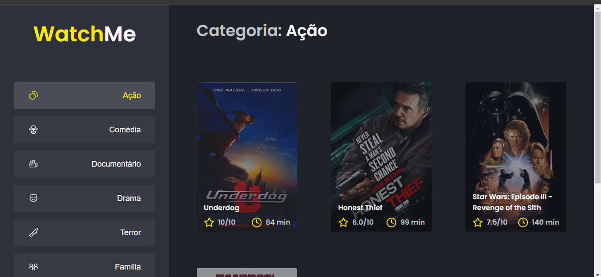

<div align="center">
	
</div>

## :dart: Objetivo

Projeto desenvolvido para por em prática os principais fundamentos da biblioteca
React.js, usando como base de dados a api do Git-Hub.

## :hammer_and_wrench: Ferramentas

- [babel](https://babeljs.io/)
- [webpack](https://webpack.js.org/)
- [cross-env](https://www.npmjs.com/package/cross-env)
- [node-sass](https://www.npmjs.com/package/node-sass)
- [html-webpack-plugin](https://www.npmjs.com/package/html-webpack-plugin)
- [axios](https://axios-http.com/ptbr/docs/intro)
- [react-refresh](https://www.npmjs.com/package/react-refresh)
- [typescript](https://www.typescriptlang.org/)

## :desktop_computer: Padronização de código

- [Eslint](https://eslint.org/)
- [Prettier](https://prettier.io/)
- [EditorConfig](https://editorconfig.org/)

## :rocket: Executando o projeto

```bash
// Instale as dependências

yarn install

// Concluindo a instalação rode

yarn dev
```
